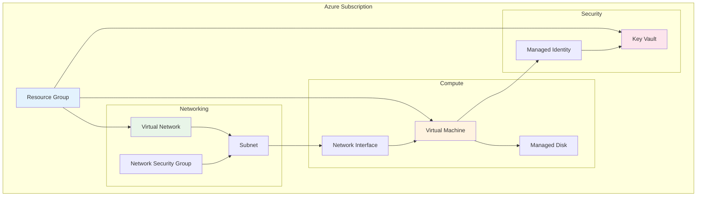

# Core Concepts

Understanding these core concepts will help you use AzAPI effectively and avoid common pitfalls.

## Resource Types and API Versions

Every AzAPI resource requires a specific type that includes the Azure resource provider, resource type, and API version:

```hcl
# Format: {ResourceProvider}/{ResourceType}@{ApiVersion}
type = "Microsoft.Storage/storageAccounts@2023-01-01"
type = "Microsoft.Compute/virtualMachines@2023-03-01"
type = "Microsoft.KeyVault/vaults@2023-02-01"
```

### API Version Selection

**For Production Workloads:**
Use the latest **stable** API version for production workloads:

```hcl
# Good for production
type = "Microsoft.Storage/storageAccounts@2023-01-01"
```

**For Preview Features:**
Use preview versions only when you need specific new features:

```hcl
# Use with caution - preview features may change
type = "Microsoft.Storage/storageAccounts@2023-05-01-preview"
```

## State Management

AzAPI provides powerful state management through the `response_export_values` parameter:

```hcl
resource "azapi_resource" "storage_account" {
  type      = "Microsoft.Storage/storageAccounts@2023-01-01"
  name      = "mystorageaccount"
  location  = "East US"
  parent_id = var.resource_group_id
  
  body = jsonencode({
    kind = "StorageV2"
    sku  = { name = "Standard_LRS" }
    properties = {
      supportsHttpsTrafficOnly = true
    }
  })
  
  # Only export values you need
  response_export_values = [
    "properties.primaryEndpoints.blob",
    "properties.primaryKey"
  ]
}

# Use exported values
locals {
  blob_endpoint = jsondecode(azapi_resource.storage_account.output).properties.primaryEndpoints.blob
}
```

## JSON Body Construction

The `body` parameter is where you define the resource properties. Here are patterns for managing complex JSON:

### Simple Resources

```hcl
resource "azapi_resource" "resource_group" {
  type      = "Microsoft.Resources/resourceGroups@2021-04-01"
  name      = "my-rg"
  location  = "East US"
  parent_id = "/subscriptions/${var.subscription_id}"
  
  body = jsonencode({
    properties = {}
  })
}
```

### Complex Resources with Locals

```hcl
locals {
  vm_config = {
    properties = {
      hardwareProfile = {
        vmSize = var.vm_size
      }
      storageProfile = {
        imageReference = {
          publisher = "Canonical"
          offer     = "0001-com-ubuntu-server-focal"
          sku       = "20_04-lts-gen2"
          version   = "latest"
        }
        osDisk = {
          name         = "${var.vm_name}-osdisk"
          caching      = "ReadWrite"
          createOption = "FromImage"
          managedDisk = {
            storageAccountType = "Premium_LRS"
          }
        }
      }
      osProfile = {
        computerName  = var.vm_name
        adminUsername = var.admin_username
      }
      osProfile = {
        linuxConfiguration = {
          disablePasswordAuthentication = true
          ssh = {
            publicKeys = [
              {
                path    = "/home/${var.admin_username}/.ssh/authorized_keys"
                keyData = var.public_key
              }
            ]
          }
        }
      }
      networkProfile = {
        networkInterfaces = [
          {
            id = azapi_resource.network_interface.id
          }
        ]
      }
    }
  }
}

resource "azapi_resource" "virtual_machine" {
  type      = "Microsoft.Compute/virtualMachines@2023-03-01"
  name      = var.vm_name
  location  = var.location
  parent_id = var.resource_group_id
  
  body = jsonencode(local.vm_config)
}
```

## Data Sources

Use `azapi_resource_list` and `azapi_resource_id` for data operations:

```hcl
# List all storage accounts in a resource group
data "azapi_resource_list" "storage_accounts" {
  type      = "Microsoft.Storage/storageAccounts@2023-01-01"
  parent_id = var.resource_group_id
}

# Get a specific resource by name
data "azapi_resource" "existing_storage" {
  type      = "Microsoft.Storage/storageAccounts@2023-01-01"
  name      = "existingstorageaccount"
  parent_id = var.resource_group_id
}
```

## Tagging Strategy

Consistent tagging is essential for resource management:

```hcl
locals {
  common_tags = {
    Environment   = var.environment
    Project      = var.project_name
    ManagedBy    = "terraform"
    Owner        = var.owner_email
    CostCenter   = var.cost_center
    CreatedDate  = timestamp()
  }
}

resource "azapi_resource" "tagged_resource" {
  type      = "Microsoft.Storage/storageAccounts@2023-01-01"
  name      = var.storage_name
  location  = var.location
  parent_id = var.resource_group_id
  
  body = jsonencode({
    kind = "StorageV2"
    sku  = { name = "Standard_LRS" }
    properties = {
      supportsHttpsTrafficOnly = true
    }
  })
  
  tags = merge(local.common_tags, {
    Purpose = "Application Data"
    Backup  = "Required"
  })
}
```

## Resource Relationships

Understanding how Azure resources relate to each other:



## Error Handling

AzAPI provides detailed error information:

```hcl
resource "azapi_resource" "storage_with_validation" {
  type      = "Microsoft.Storage/storageAccounts@2023-01-01"
  name      = var.storage_name
  location  = var.location
  parent_id = var.resource_group_id
  
  body = jsonencode({
    kind = "StorageV2"
    sku  = { name = var.storage_sku }
    properties = {
      supportsHttpsTrafficOnly = true
      minimumTlsVersion       = "TLS1_2"
    }
  })
  
  # Lifecycle management
  lifecycle {
    # Prevent accidental deletion
    prevent_destroy = true
    
    # Ignore changes to certain properties
    ignore_changes = [
      body.properties.lastGeoFailoverTime
    ]
  }
}
```

## Performance Considerations

### Parallel Execution

AzAPI resources can be created in parallel when there are no dependencies:

```hcl
# These resources will be created in parallel
resource "azapi_resource" "storage_account_1" {
  type      = "Microsoft.Storage/storageAccounts@2023-01-01"
  name      = "storage1"
  location  = var.location
  parent_id = var.resource_group_id
  body      = jsonencode(local.storage_config)
}

resource "azapi_resource" "storage_account_2" {
  type      = "Microsoft.Storage/storageAccounts@2023-01-01"
  name      = "storage2"
  location  = var.location
  parent_id = var.resource_group_id
  body      = jsonencode(local.storage_config)
}

resource "azapi_resource" "storage_account_3" {
  type      = "Microsoft.Storage/storageAccounts@2023-01-01"
  name      = "storage3"
  location  = var.location
  parent_id = var.resource_group_id
  body      = jsonencode(local.storage_config)
}
```

### State File Optimization

Keep your state file lean:

```hcl
resource "azapi_resource" "large_resource" {
  type      = "Microsoft.Compute/virtualMachines@2023-03-01"
  name      = var.vm_name
  location  = var.location
  parent_id = var.resource_group_id
  body      = jsonencode(local.vm_config)
  
  # Only export what you actually use
  response_export_values = [
    "properties.vmId",
    "properties.provisioningState"
  ]
  
  # Don't export the entire response
  # response_export_values = ["*"]  # Avoid this
}
```

**Pro Tip**: Use `terraform plan -out=plan.tfplan` and `terraform show -json plan.tfplan` to understand what changes AzAPI will make before applying them.

## Next Steps

Now that you understand the core concepts, let's explore [resource management best practices](../resource-management/).