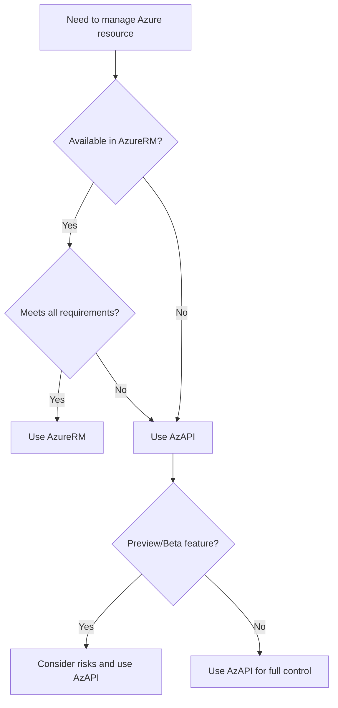

# Getting Started with AzAPI

The AzAPI provider is a powerful Terraform provider that allows you to manage Azure resources using the Azure REST API directly. This chapter will help you get started with the basics.

## Why AzAPI?

The AzAPI provider offers several advantages over the traditional AzureRM provider:

- **Latest Azure Features**: Access to new Azure services and features immediately
- **Full API Coverage**: Direct access to all Azure REST API endpoints
- **Flexibility**: Fine-grained control over resource configurations
- **Future Proof**: Built to handle Azure's evolving API landscape

**Best Practice**: Use AzAPI for new Azure features that aren't yet available in AzureRM, or when you need specific configurations not supported by AzureRM.

## Installation

Add the AzAPI provider to your Terraform configuration:

```hcl
terraform {
  required_providers {
    azapi = {
      source  = "Azure/azapi"
      version = "~>1.0"
    }
  }
}

provider "azapi" {
}
```

## Authentication

The AzAPI provider supports multiple authentication methods:

### Service Principal Authentication

```hcl
provider "azapi" {
  client_id       = var.client_id
  client_secret   = var.client_secret
  tenant_id       = var.tenant_id
  subscription_id = var.subscription_id
}
```

### Azure CLI Authentication

When using Azure CLI, the provider automatically uses your current authentication context:

```bash
az login
terraform init
terraform plan
```

## Your First AzAPI Resource

Let's create a simple resource group using the AzAPI provider:

```hcl
resource "azapi_resource" "example_rg" {
  type      = "Microsoft.Resources/resourceGroups@2021-04-01"
  name      = "example-rg"
  location  = "East US"
  parent_id = "/subscriptions/${var.subscription_id}"
  
  body = jsonencode({
    properties = {}
  })
}
```

## Architecture Decision Flow

The following diagram shows when to choose AzAPI over other options:



## Next Steps

Now that you understand the basics of AzAPI, let's dive deeper into [understanding the provider architecture](../understanding-azapi/).

**Important**: Always test AzAPI configurations in non-production environments first, especially when working with preview features.