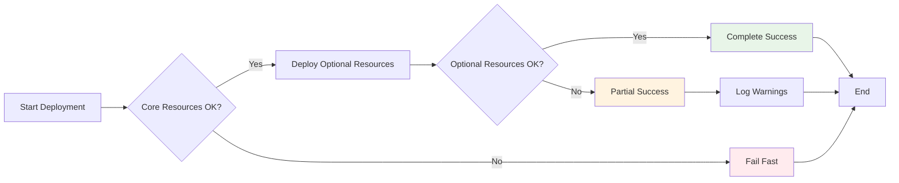

# Resource Management Best Practices

Effective resource management is crucial for maintaining reliable and scalable infrastructure with AzAPI. This chapter covers proven patterns and practices.

## Resource Lifecycle Management

### State Management

AzAPI provides excellent state management capabilities:

```hcl
resource "azapi_resource" "managed_identity" {
  type      = "Microsoft.ManagedIdentity/userAssignedIdentities@2023-01-31"
  name      = "app-identity"
  location  = var.location
  parent_id = var.resource_group_id
  
  # Export specific values to optimize state size
  response_export_values = ["properties.clientId", "properties.principalId"]
}

# Use exported values in other resources
resource "azapi_resource" "role_assignment" {
  type      = "Microsoft.Authorization/roleAssignments@2022-04-01"
  name      = uuidv5("dns", "${azapi_resource.managed_identity.id}-contributor")
  parent_id = var.resource_group_id
  
  body = jsonencode({
    properties = {
      roleDefinitionId = "/subscriptions/${var.subscription_id}/providers/Microsoft.Authorization/roleDefinitions/b24988ac-6180-42a0-ab88-20f7382dd24c"
      principalId     = jsondecode(azapi_resource.managed_identity.output).properties.principalId
      principalType   = "ServicePrincipal"
    }
  })
}
```

## Resource Dependencies

### Implicit Dependencies

AzAPI automatically handles dependencies when you reference resources:

```hcl
resource "azapi_resource" "vnet" {
  type      = "Microsoft.Network/virtualNetworks@2023-04-01"
  name      = "main-vnet"
  location  = var.location
  parent_id = var.resource_group_id
  
  body = jsonencode({
    properties = {
      addressSpace = {
        addressPrefixes = ["10.0.0.0/16"]
      }
    }
  })
}

resource "azapi_resource" "subnet" {
  type      = "Microsoft.Network/virtualNetworks/subnets@2023-04-01"
  name      = "app-subnet"
  parent_id = azapi_resource.vnet.id  # Implicit dependency
  
  body = jsonencode({
    properties = {
      addressPrefix = "10.0.1.0/24"
    }
  })
}
```

### Explicit Dependencies

Use `depends_on` when implicit dependencies aren't sufficient:

```hcl
resource "azapi_resource" "key_vault" {
  type      = "Microsoft.KeyVault/vaults@2023-02-01"
  name      = var.key_vault_name
  location  = var.location
  parent_id = var.resource_group_id
  
  body = jsonencode({
    properties = {
      sku = { family = "A", name = "standard" }
      tenantId = var.tenant_id
      accessPolicies = []
      enableRbacAuthorization = true
    }
  })
  
  # Ensure RBAC assignments exist first
  depends_on = [azapi_resource.key_vault_admin_assignment]
}
```

## Resource Organization Patterns

### Module Structure

Organize resources logically within modules:

```
modules/
├── networking/
│   ├── main.tf
│   ├── variables.tf
│   └── outputs.tf
├── security/
│   ├── key-vault/
│   │   ├── main.tf
│   │   ├── variables.tf
│   │   └── outputs.tf
│   └── managed-identity/
└── compute/
```

### Naming Conventions

Establish consistent naming patterns:

```hcl
locals {
  # Consistent naming pattern
  naming = {
    prefix      = "${var.project}-${var.environment}"
    location    = var.location
    rg_name     = "${local.naming.prefix}-rg"
    kv_name     = "${local.naming.prefix}-kv"
    storage_name = replace("${local.naming.prefix}st", "-", "")  # Storage accounts can't have hyphens
  }
}

resource "azapi_resource" "storage_account" {
  type      = "Microsoft.Storage/storageAccounts@2023-01-01"
  name      = local.naming.storage_name
  location  = local.naming.location
  parent_id = var.resource_group_id
  
  body = jsonencode({
    kind = "StorageV2"
    sku  = { name = "Standard_LRS" }
    properties = {
      supportsHttpsTrafficOnly = true
      minimumTlsVersion       = "TLS1_2"
    }
  })

  tags = {
    Environment = var.environment
    Project     = var.project
    ManagedBy   = "terraform"
  }
}
```

## Error Handling and Recovery

### Retry Logic

Handle transient failures with retry configurations:

```hcl
resource "azapi_resource" "complex_deployment" {
  type      = "Microsoft.Resources/deploymentScripts@2020-10-01"
  name      = "complex-setup"
  location  = var.location
  parent_id = var.resource_group_id
  
  # Configure retries for this resource
  timeouts {
    create = "30m"
    update = "30m"
    delete = "30m"
  }
  
  body = jsonencode({
    kind = "AzureCLI"
    properties = {
      azCliVersion = "2.40.0"
      scriptContent = file("${path.module}/scripts/setup.sh")
      retentionInterval = "P1D"
      timeout = "PT30M"
    }
  })
}
```

### Graceful Degradation

Design for partial failures:



## Resource Updates and Changes

### In-Place Updates vs. Replacement

Understand when AzAPI will update vs. replace resources:

```hcl
resource "azapi_resource" "app_service" {
  type      = "Microsoft.Web/sites@2022-03-01"
  name      = var.app_name
  location  = var.location
  parent_id = var.resource_group_id
  
  body = jsonencode({
    properties = {
      serverFarmId = var.app_service_plan_id
      httpsOnly    = true
      
      # These changes typically trigger in-place updates
      siteConfig = {
        alwaysOn        = var.always_on
        linuxFxVersion = var.runtime_stack
        appSettings = [
          for key, value in var.app_settings : {
            name  = key
            value = value
          }
        ]
      }
    }
    
    # SKU changes typically require replacement
    # Plan accordingly
  })
  
  # Prevent accidental deletion of critical resources
  lifecycle {
    prevent_destroy = true
  }
}
```

### Blue-Green Deployments

Implement zero-downtime deployments:

```hcl
resource "azapi_resource" "app_service_green" {
  count     = var.deployment_slot == "green" ? 1 : 0
  type      = "Microsoft.Web/sites@2022-03-01"
  name      = "${var.app_name}-green"
  location  = var.location
  parent_id = var.resource_group_id
  
  body = jsonencode({
    properties = {
      serverFarmId = var.app_service_plan_id
      httpsOnly    = true
      siteConfig   = var.app_config
    }
  })
}

resource "azapi_resource" "app_service_blue" {
  count     = var.deployment_slot == "blue" ? 1 : 0
  type      = "Microsoft.Web/sites@2022-03-01"
  name      = "${var.app_name}-blue"
  location  = var.location
  parent_id = var.resource_group_id
  
  body = jsonencode({
    properties = {
      serverFarmId = var.app_service_plan_id
      httpsOnly    = true
      siteConfig   = var.app_config
    }
  })
}
```

**Best Practice**: Always test resource changes in non-production environments first, and maintain rollback procedures for critical resources.

## Next Steps

Learn about implementing [security and compliance](../security-compliance/) measures in your AzAPI deployments.