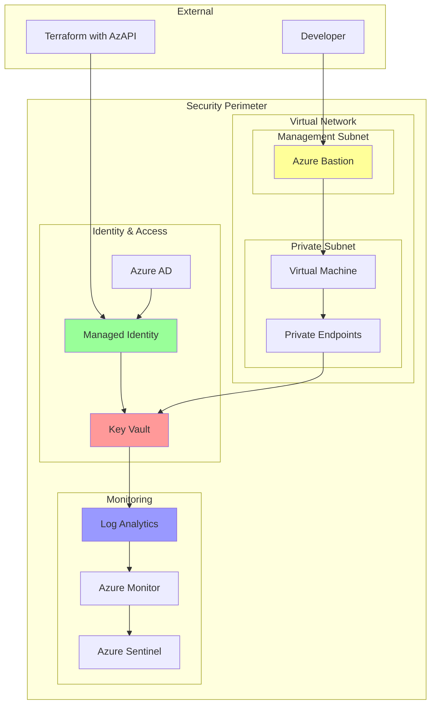

# Security & Compliance with AzAPI

Security should be a primary consideration when managing Azure resources with AzAPI. This chapter covers security best practices, compliance strategies, and implementation patterns.

## Authentication & Authorization

### Service Principal Best Practices

When using service principals with AzAPI, follow the principle of least privilege:

```hcl
# Create a dedicated service principal for AzAPI operations
resource "azapi_resource" "azapi_app_registration" {
  type      = "Microsoft.Graph/applications@v1.0"
  name      = "azapi-terraform-sp"
  parent_id = "/applications"
  
  body = jsonencode({
    displayName = "AzAPI Terraform Service Principal"
    description = "Service principal for AzAPI Terraform operations"
    requiredResourceAccess = [
      {
        resourceAppId = "00000003-0000-0000-c000-000000000000" # Microsoft Graph
        resourceAccess = [
          {
            id   = "e1fe6dd8-ba31-4d61-89e7-88639da4683d" # User.Read
            type = "Scope"
          }
        ]
      }
    ]
  })
}
```

### Managed Identity Integration

Use managed identities when possible for enhanced security:

```hcl
resource "azapi_resource" "user_assigned_identity" {
  type      = "Microsoft.ManagedIdentity/userAssignedIdentities@2023-01-31"
  name      = "azapi-terraform-identity"
  location  = var.location
  parent_id = var.resource_group_id
  
  response_export_values = ["properties.clientId", "properties.principalId"]
}

# Assign necessary roles to the managed identity
resource "azapi_resource" "role_assignment" {
  type      = "Microsoft.Authorization/roleAssignments@2022-04-01"
  name      = uuidv5("dns", "${azapi_resource.user_assigned_identity.id}-contributor")
  parent_id = var.subscription_scope
  
  body = jsonencode({
    properties = {
      roleDefinitionId = "/subscriptions/${var.subscription_id}/providers/Microsoft.Authorization/roleDefinitions/b24988ac-6180-42a0-ab88-20f7382dd24c"
      principalId     = jsondecode(azapi_resource.user_assigned_identity.output).properties.principalId
      principalType   = "ServicePrincipal"
    }
  })
}
```

## Secret Management

### Key Vault Integration

Always store sensitive configuration in Azure Key Vault:

```hcl
resource "azapi_resource" "key_vault" {
  type      = "Microsoft.KeyVault/vaults@2023-02-01"
  name      = var.key_vault_name
  location  = var.location
  parent_id = var.resource_group_id
  
  body = jsonencode({
    properties = {
      sku = {
        family = "A"
        name   = "standard"
      }
      tenantId = var.tenant_id
      accessPolicies = []
      enableRbacAuthorization = true
      enabledForDeployment = true
      enabledForTemplateDeployment = true
      enabledForDiskEncryption = true
      softDeleteRetentionInDays = 90
      enablePurgeProtection = true
      networkAcls = {
        bypass = "AzureServices"
        defaultAction = "Deny"
        ipRules = [
          for ip in var.allowed_ips : {
            value = ip
          }
        ]
      }
    }
  })
}

# Store database connection strings securely
resource "azapi_data_plane_resource" "db_connection_secret" {
  type      = "Microsoft.KeyVault/vaults/secrets@7.4"
  parent_id = "${azapi_resource.key_vault.id}/secrets"
  name      = "database-connection-string"
  
  body = jsonencode({
    value = "Server=${azapi_resource.sql_server.name}.database.windows.net;Database=${azapi_resource.sql_database.name};Authentication=Active Directory Default;"
    attributes = {
      enabled = true
      exp     = 1735689600 # 2025-01-01
    }
    contentType = "text/plain"
  })
}
```

## Network Security

### Private Endpoints and Virtual Networks

Implement network isolation using private endpoints:

```hcl
resource "azapi_resource" "storage_private_endpoint" {
  type      = "Microsoft.Network/privateEndpoints@2023-04-01"
  name      = "${var.storage_account_name}-pe"
  location  = var.location
  parent_id = var.resource_group_id
  
  body = jsonencode({
    properties = {
      subnet = {
        id = var.private_endpoint_subnet_id
      }
      privateLinkServiceConnections = [
        {
          name = "${var.storage_account_name}-psc"
          properties = {
            privateLinkServiceId = azapi_resource.storage_account.id
            groupIds = ["blob"]
          }
        }
      ]
    }
  })
}

# Private DNS Zone for name resolution
resource "azapi_resource" "private_dns_zone" {
  type      = "Microsoft.Network/privateDnsZones@2020-06-01"
  name      = "privatelink.blob.core.windows.net"
  parent_id = var.resource_group_id
  
  body = jsonencode({
    location = "global"
    properties = {}
  })
}
```

## Compliance and Governance

### Policy Assignment

Ensure compliance with organizational policies:

```hcl
resource "azapi_resource" "policy_assignment" {
  type      = "Microsoft.Authorization/policyAssignments@2022-06-01"
  name      = "require-https-storage"
  parent_id = var.resource_group_id
  
  body = jsonencode({
    properties = {
      policyDefinitionId = "/providers/Microsoft.Authorization/policyDefinitions/404c3081-a854-4457-ae30-26a93ef643f9"
      displayName = "Secure transfer to storage accounts should be enabled"
      description = "Enforce secure transfer (HTTPS) to storage accounts"
      enforcementMode = "Default"
      parameters = {}
    }
  })
}
```

### Resource Tags for Compliance

Implement consistent tagging for governance:

```hcl
locals {
  compliance_tags = {
    Environment     = var.environment
    DataClass      = var.data_classification
    Owner          = var.resource_owner
    CostCenter     = var.cost_center
    Project        = var.project_name
    Compliance     = var.compliance_framework
    BackupRequired = var.backup_required
    CreatedBy      = "terraform-azapi"
    CreatedDate    = timestamp()
  }
}

resource "azapi_resource" "compliant_storage" {
  type      = "Microsoft.Storage/storageAccounts@2023-01-01"
  name      = var.storage_name
  location  = var.location
  parent_id = var.resource_group_id
  
  body = jsonencode({
    kind = "StorageV2"
    sku = { name = "Standard_LRS" }
    properties = {
      supportsHttpsTrafficOnly = true
      minimumTlsVersion = "TLS1_2"
      allowBlobPublicAccess = false
      allowSharedKeyAccess = false
      defaultToOAuthAuthentication = true
      encryption = {
        services = {
          blob = { enabled = true }
          file = { enabled = true }
        }
        keySource = "Microsoft.Storage"
        requireInfrastructureEncryption = true
      }
    }
  })
  
  tags = local.compliance_tags
}
```

## Security Monitoring and Auditing

### Diagnostic Settings

Enable comprehensive logging:

```hcl
resource "azapi_resource" "diagnostic_settings" {
  type      = "Microsoft.Insights/diagnosticSettings@2021-05-01-preview"
  name      = "security-monitoring"
  parent_id = azapi_resource.key_vault.id
  
  body = jsonencode({
    properties = {
      workspaceId = var.log_analytics_workspace_id
      logs = [
        {
          category = "AuditEvent"
          enabled  = true
          retentionPolicy = {
            enabled = true
            days    = 365
          }
        }
      ]
      metrics = [
        {
          category = "AllMetrics"
          enabled  = true
          retentionPolicy = {
            enabled = true
            days    = 365
          }
        }
      ]
    }
  })
}
```

## Security Architecture Diagram

The following shows a secure AzAPI deployment architecture:



## Security Checklist

Before deploying AzAPI resources to production, ensure:

**Authentication & Authorization:**
- [ ] Service principals use least privilege access
- [ ] Managed identities are used where possible
- [ ] Role assignments are scoped appropriately
- [ ] Multi-factor authentication is enforced

**Network Security:**
- [ ] Private endpoints are configured for PaaS services
- [ ] Network security groups restrict traffic appropriately
- [ ] Azure Firewall or NVAs control outbound traffic
- [ ] DDoS protection is enabled for public resources

**Data Protection:**
- [ ] Encryption at rest is enabled
- [ ] Encryption in transit is enforced
- [ ] Key management follows best practices
- [ ] Data classification tags are applied

**Monitoring & Compliance:**
- [ ] Diagnostic settings are configured
- [ ] Security alerts are set up
- [ ] Compliance policies are assigned
- [ ] Regular security assessments are performed

**Best Practice**: Regularly review and audit your AzAPI configurations using tools like Azure Security Center and Azure Policy compliance reports.

## Next Steps

Learn about [performance optimization](../performance/) techniques for your AzAPI deployments.