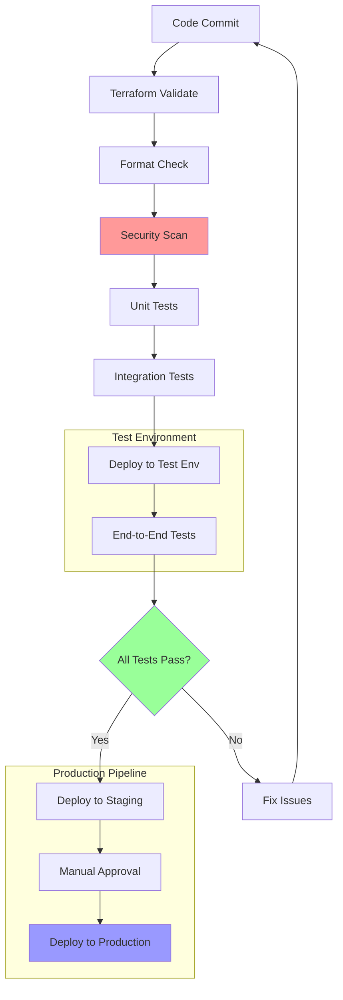

# Testing Strategies for AzAPI

Testing is crucial for maintaining reliable infrastructure. This chapter covers comprehensive testing approaches for AzAPI-based Terraform configurations.

## Types of Testing

### Unit Testing with Terratest

Use Terratest to validate individual resources:

```go
package test

import (
    "testing"
    "github.com/gruntwork-io/terratest/modules/terraform"
    "github.com/stretchr/testify/assert"
)

func TestAzAPIStorageAccount(t *testing.T) {
    terraformOptions := terraform.WithDefaultRetryableErrors(t, &terraform.Options{
        TerraformDir: "../examples/storage-account",
        Vars: map[string]interface{}{
            "resource_group_name": "test-rg",
            "storage_account_name": "teststorage" + strings.ToLower(random.UniqueId()),
            "location": "East US",
        },
    })
    
    defer terraform.Destroy(t, terraformOptions)
    terraform.InitAndApply(t, terraformOptions)
    
    // Validate storage account properties
    storageAccountName := terraform.Output(t, terraformOptions, "storage_account_name")
    assert.NotEmpty(t, storageAccountName)
    
    // Validate HTTPS-only is enabled
    httpsOnly := terraform.Output(t, terraformOptions, "https_only")
    assert.Equal(t, "true", httpsOnly)
}
```

### Integration Testing

Test complete infrastructure stacks:

```hcl
# test/fixtures/complete-stack/main.tf
module "azapi_stack" {
  source = "../../../"
  
  # Test configuration
  environment         = "test"
  location           = "East US"
  resource_group_name = var.resource_group_name
  
  # Override for testing
  storage_sku = "Standard_LRS"
  vm_size     = "Standard_B1s"
}

# Outputs for validation
output "resource_group_id" {
  value = module.azapi_stack.resource_group_id
}

output "storage_endpoints" {
  value = module.azapi_stack.storage_endpoints
  sensitive = true
}
```

## Validation Patterns

### Schema Validation

Validate JSON schemas before deployment:

```hcl
locals {
  # Validate storage account configuration schema
  storage_config = {
    kind = "StorageV2"
    sku  = { name = var.storage_sku }
    properties = {
      supportsHttpsTrafficOnly = true
      minimumTlsVersion       = "TLS1_2"
      allowBlobPublicAccess   = var.allow_public_access
    }
  }
  
  # Validate required properties exist
  validated_config = can(local.storage_config.sku.name) ? local.storage_config : null
}

resource "azapi_resource" "storage_account" {
  count = local.validated_config != null ? 1 : 0
  
  type      = "Microsoft.Storage/storageAccounts@2023-01-01"
  name      = var.storage_name
  location  = var.location
  parent_id = var.resource_group_id
  
  body = jsonencode(local.validated_config)
  
  lifecycle {
    precondition {
      condition     = can(regex("^[a-z0-9]{3,24}$", var.storage_name))
      error_message = "Storage account name must be 3-24 characters, lowercase letters and numbers only."
    }
    
    precondition {
      condition     = contains(["Standard_LRS", "Standard_GRS", "Premium_LRS"], var.storage_sku)
      error_message = "Storage SKU must be one of: Standard_LRS, Standard_GRS, Premium_LRS."
    }
  }
}
```

### Custom Validation Functions

Create reusable validation functions:

```hcl
# modules/validation/main.tf
variable "azure_resource_name" {
  type = string
}

variable "resource_type" {
  type = string
}

locals {
  # Azure resource naming validation rules
  validation_rules = {
    "storage_account" = {
      min_length = 3
      max_length = 24
      pattern    = "^[a-z0-9]+$"
    }
    "key_vault" = {
      min_length = 3
      max_length = 24
      pattern    = "^[a-zA-Z0-9-]+$"
    }
    "virtual_machine" = {
      min_length = 1
      max_length = 80
      pattern    = "^[a-zA-Z0-9-_]+$"
    }
  }
  
  rule = local.validation_rules[var.resource_type]
  
  is_valid = (
    length(var.azure_resource_name) >= local.rule.min_length &&
    length(var.azure_resource_name) <= local.rule.max_length &&
    can(regex(local.rule.pattern, var.azure_resource_name))
  )
}

output "is_valid" {
  value = local.is_valid
}

output "validation_message" {
  value = local.is_valid ? "Valid" : "Invalid resource name for ${var.resource_type}"
}
```

## Testing Environments

### Environment Isolation

Use separate configurations for testing:

```hcl
# environments/test/main.tf
terraform {
  required_providers {
    azapi = {
      source  = "Azure/azapi"
      version = "~>1.0"
    }
  }
  
  backend "azurerm" {
    resource_group_name  = "terraform-state-test"
    storage_account_name = "tfstatetest"
    container_name       = "tfstate"
    key                  = "test.terraform.tfstate"
  }
}

module "infrastructure" {
  source = "../../modules/infrastructure"
  
  environment = "test"
  location    = "East US"
  
  # Test-specific overrides
  enable_monitoring = false
  storage_sku      = "Standard_LRS"
  vm_count         = 1
}
```

### Temporary Resource Naming

Generate unique names for test resources:

```hcl
resource "random_id" "test_suffix" {
  byte_length = 4
}

locals {
  test_suffix = random_id.test_suffix.hex
  
  test_names = {
    resource_group   = "test-azapi-rg-${local.test_suffix}"
    storage_account  = "testazapi${local.test_suffix}"
    key_vault       = "test-kv-${local.test_suffix}"
  }
}
```

## Continuous Integration Testing

### GitHub Actions Workflow

Automate testing with CI/CD:

```yaml
name: AzAPI Infrastructure Tests

on:
  push:
    branches: [ main, develop ]
  pull_request:
    branches: [ main ]

jobs:
  terraform-tests:
    runs-on: ubuntu-latest
    
    steps:
    - uses: actions/checkout@v4
    
    - name: Setup Terraform
      uses: hashicorp/setup-terraform@v3
      with:
        terraform_version: 1.6.0
    
    - name: Setup Go
      uses: actions/setup-go@v4
      with:
        go-version: '1.21'
    
    - name: Azure Login
      uses: azure/login@v1
      with:
        creds: ${{ secrets.AZURE_CREDENTIALS }}
    
    - name: Run Terraform Validation
      run: |
        terraform init
        terraform validate
        terraform fmt -check
    
    - name: Run Terratest
      run: |
        cd test
        go mod tidy
        go test -v -timeout 30m
      env:
        ARM_CLIENT_ID: ${{ secrets.ARM_CLIENT_ID }}
        ARM_CLIENT_SECRET: ${{ secrets.ARM_CLIENT_SECRET }}
        ARM_TENANT_ID: ${{ secrets.ARM_TENANT_ID }}
        ARM_SUBSCRIPTION_ID: ${{ secrets.ARM_SUBSCRIPTION_ID }}
    
    - name: Cleanup Test Resources
      if: always()
      run: |
        # Cleanup script to remove test resources
        az group list --tag Environment=test --query "[].name" -o tsv | \
        xargs -I {} az group delete --name {} --yes --no-wait
```

## Testing Best Practices

### Test Data Management

Organize test data effectively:

```hcl
# test/fixtures/test-data.tf
locals {
  test_scenarios = {
    "basic_storage" = {
      name        = "basicteststorage"
      sku         = "Standard_LRS"
      https_only  = true
      public_access = false
    }
    "premium_storage" = {
      name        = "premiumteststorage" 
      sku         = "Premium_LRS"
      https_only  = true
      public_access = false
    }
    "geo_redundant" = {
      name        = "geoteststorage"
      sku         = "Standard_GRS"
      https_only  = true
      public_access = false
    }
  }
}

# Generate test configurations
output "test_scenarios" {
  value = local.test_scenarios
}
```

### Mock and Stub Strategies

Use data sources to simulate dependencies:

```hcl
# For testing, use existing resources instead of creating new ones
data "azapi_resource" "existing_vnet" {
  count = var.environment == "test" ? 1 : 0
  
  type      = "Microsoft.Network/virtualNetworks@2023-04-01"
  name      = "test-vnet"
  parent_id = var.test_resource_group_id
}

resource "azapi_resource" "vnet" {
  count = var.environment == "test" ? 0 : 1
  
  type      = "Microsoft.Network/virtualNetworks@2023-04-01"
  name      = var.vnet_name
  location  = var.location
  parent_id = var.resource_group_id
  
  body = jsonencode({
    properties = {
      addressSpace = {
        addressPrefixes = var.address_prefixes
      }
    }
  })
}

locals {
  vnet_id = var.environment == "test" ? data.azapi_resource.existing_vnet[0].id : azapi_resource.vnet[0].id
}
```

## Testing Workflow Diagram



## Error Testing

### Deliberate Failure Testing

Test error handling scenarios:

```hcl
# Test invalid configuration handling
resource "azapi_resource" "test_invalid_storage" {
  count = var.test_invalid_configs ? 1 : 0
  
  type      = "Microsoft.Storage/storageAccounts@2023-01-01"
  name      = "invalid-storage-name-with-hyphens" # This should fail
  location  = var.location
  parent_id = var.resource_group_id
  
  body = jsonencode({
    kind = "StorageV2"
    sku  = { name = "Invalid_SKU" } # This should fail
    properties = {
      supportsHttpsTrafficOnly = true
    }
  })
  
  # This resource is expected to fail for testing
  lifecycle {
    ignore_changes = all
  }
}
```

### Recovery Testing

Test state recovery scenarios:

```bash
#!/bin/bash
# recovery-test.sh

echo "Testing Terraform state recovery..."

# Backup current state
terraform state pull > state-backup.json

# Introduce state inconsistency
terraform state rm azapi_resource.storage_account

# Test import capability
terraform import azapi_resource.storage_account "/subscriptions/$ARM_SUBSCRIPTION_ID/resourceGroups/test-rg/providers/Microsoft.Storage/storageAccounts/teststorage"

# Validate state consistency
terraform plan -detailed-exitcode

if [ $? -eq 0 ]; then
    echo "✅ State recovery test passed"
else
    echo "❌ State recovery test failed"
    terraform state push state-backup.json
    exit 1
fi
```

**Best Practice**: Always include automated testing in your AzAPI development workflow to catch issues early and ensure reliable deployments.

## Next Steps

Explore [common patterns and reusable templates](../patterns/) for AzAPI implementations.