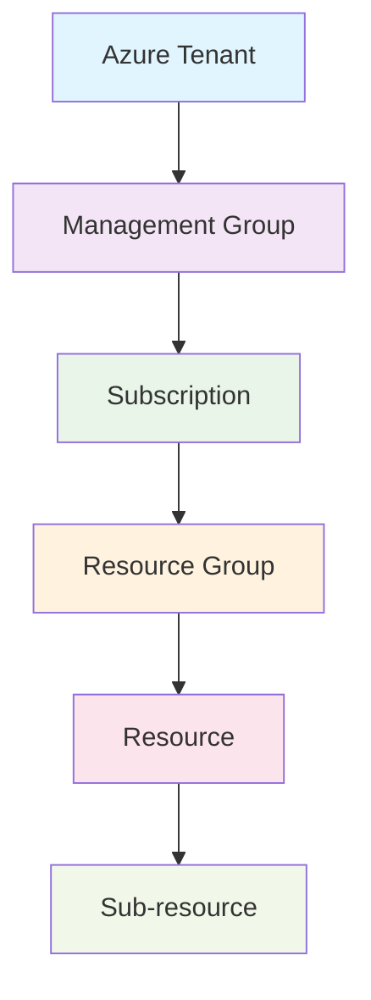

# Understanding AzAPI Architecture

The AzAPI provider is designed around Azure's REST API structure, providing a generic interface to interact with any Azure service. Understanding this architecture is crucial for effective usage.

## Core Resource Types

AzAPI provides several resource types, each serving different purposes:

### azapi_resource

The primary resource type for managing Azure resources:

```hcl
resource "azapi_resource" "storage_account" {
  type      = "Microsoft.Storage/storageAccounts@2021-04-01"
  name      = "mystorageaccount"
  location  = "East US"
  parent_id = azapi_resource.resource_group.id
  
  body = jsonencode({
    kind = "StorageV2"
    properties = {
      accessTier = "Hot"
      supportsHttpsTrafficOnly = true
      minimumTlsVersion = "TLS1_2"
    }
    sku = {
      name = "Standard_LRS"
    }
  })
}
```

### azapi_data_plane_resource

For managing Azure data plane resources:

```hcl
resource "azapi_data_plane_resource" "key_vault_secret" {
  type      = "Microsoft.KeyVault/vaults/secrets@7.3"
  parent_id = "${azapi_resource.key_vault.id}/secrets"
  name      = "database-connection-string"
  
  body = jsonencode({
    value = var.connection_string
  })
}
```

## API Version Strategy

One of AzAPI's key strengths is explicit API version control:

```hcl
# Using latest stable API version
resource "azapi_resource" "vm" {
  type = "Microsoft.Compute/virtualMachines@2023-03-01"
  # ...
}

# Using preview API version for new features
resource "azapi_resource" "vm_with_preview_features" {
  type = "Microsoft.Compute/virtualMachines@2023-07-01-preview"
  # ...
}
```

### API Version Examples

**For Production (Recommended):**
```hcl
# Use stable API versions for production
type = "Microsoft.Storage/storageAccounts@2021-04-01"
```

**For Preview Features (Use with caution):**
```hcl
# Preview features may change
type = "Microsoft.Storage/storageAccounts@2023-01-01-preview"
```

## Resource Hierarchy

Understanding Azure's resource hierarchy is essential:



## Resource Identification

AzAPI uses Azure Resource IDs to identify and reference resources:

```hcl
# Full resource ID structure
resource "azapi_resource" "example" {
  # parent_id follows Azure resource ID format:
  # /subscriptions/{subscription-id}/resourceGroups/{rg-name}
  parent_id = "/subscriptions/${var.subscription_id}/resourceGroups/${var.resource_group_name}"
}
```

## Body Structure

The `body` parameter contains the resource properties as they would appear in the Azure REST API:

```hcl
resource "azapi_resource" "app_service_plan" {
  type      = "Microsoft.Web/serverfarms@2022-03-01"
  name      = "my-app-service-plan"
  location  = "East US"
  parent_id = azapi_resource.resource_group.id
  
  body = jsonencode({
    properties = {
      reserved = true  # For Linux plans
    }
    sku = {
      name     = "P1v2"
      tier     = "PremiumV2"
      size     = "P1v2"
      family   = "Pv2"
      capacity = 1
    }
    kind = "linux"
  })
}
```

## Working with JSON

Since AzAPI works with JSON bodies, here are some best practices:

### Using Variables for Complex Objects

```hcl
locals {
  storage_config = {
    kind = "StorageV2"
    properties = {
      accessTier = "Hot"
      supportsHttpsTrafficOnly = true
      minimumTlsVersion = "TLS1_2"
      allowBlobPublicAccess = false
      networkAcls = {
        bypass = "AzureServices"
        defaultAction = "Deny"
        ipRules = [
          for ip in var.allowed_ips : {
            action = "Allow"
            value  = ip
          }
        ]
      }
    }
    sku = {
      name = var.storage_sku
    }
  }
}

resource "azapi_resource" "storage" {
  type      = "Microsoft.Storage/storageAccounts@2021-04-01"
  name      = var.storage_name
  location  = var.location
  parent_id = var.resource_group_id
  
  body = jsonencode(local.storage_config)
}
```

## Response Extraction

Use the `response_export_values` to extract specific values from the API response:

```hcl
resource "azapi_resource" "storage_account" {
  type      = "Microsoft.Storage/storageAccounts@2021-04-01"
  name      = "mystorageaccount"
  # ... other configuration
  
  response_export_values = ["properties.primaryEndpoints"]
}

# Access extracted values
output "storage_endpoints" {
  value = jsondecode(azapi_resource.storage_account.output).properties.primaryEndpoints
}
```

**Performance Tip**: Only export the values you actually need to reduce state file size and improve performance.

## Next Steps

Now that you understand AzAPI's architecture, let's explore the [core concepts](../core-concepts/) that will help you use it effectively.